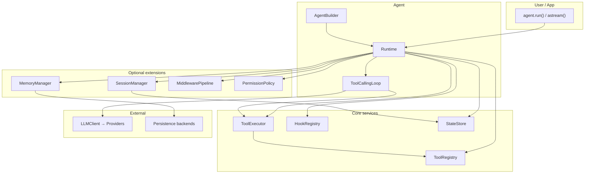
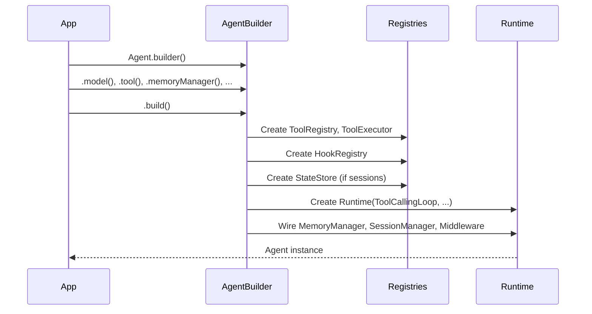
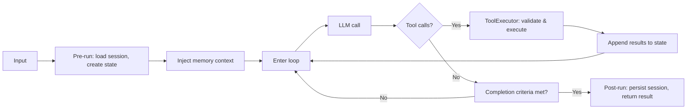
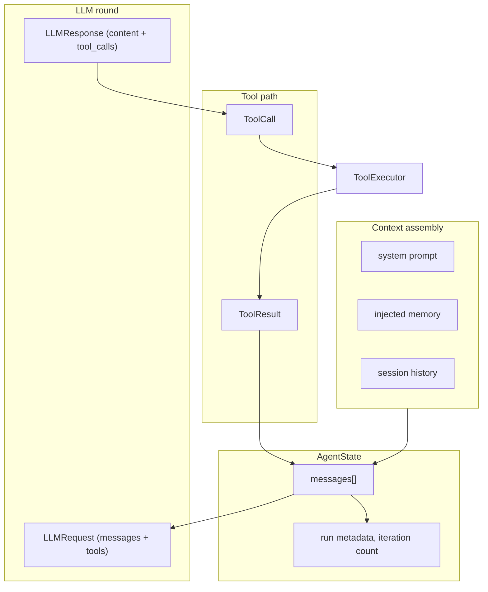
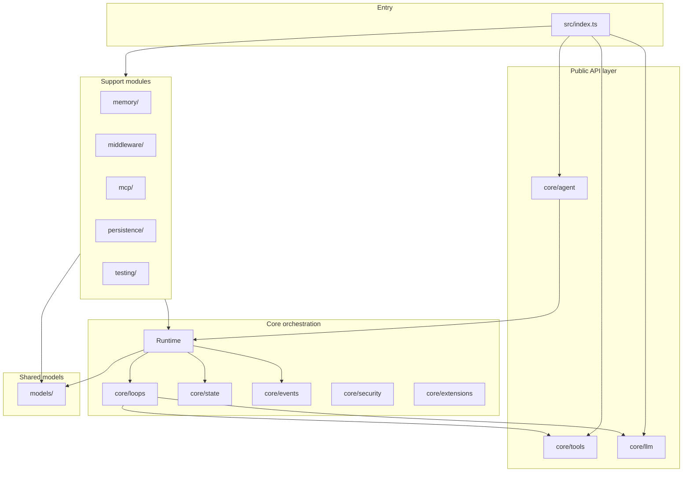

# Architecture Guide

This document explains how the TypeScript SDK is composed, how data flows through a run, and where to extend behavior safely.

It is intended for:
- SDK contributors
- application engineers building production agents
- teams debugging behavior or performance across complex runs

## Table of Contents

- [Design Goals](#design-goals)
- [Architecture Overview (Diagrams)](#architecture-overview-diagrams)
- [System Overview](#system-overview)
- [Build-time Composition](#build-time-composition)
- [Run-time Execution Lifecycle](#run-time-execution-lifecycle)
- [Core Modules and Responsibilities](#core-modules-and-responsibilities)
- [State, Sessions, and Persistence](#state-sessions-and-persistence)
- [Memory Architecture](#memory-architecture)
- [Tooling Architecture](#tooling-architecture)
- [LLM Architecture and Resilience](#llm-architecture-and-resilience)
- [Middleware, Hooks, and Eventing](#middleware-hooks-and-eventing)
- [Subagent Architecture](#subagent-architecture)
- [MCP Integration Model](#mcp-integration-model)
- [Security and Permissions](#security-and-permissions)
- [Operational Considerations](#operational-considerations)
- [Common Debugging Paths](#common-debugging-paths)

## Design Goals

The architecture optimizes for:
- composability (swap components without rewriting app logic)
- runtime safety (schema validation, permission boundaries, predictable error paths)
- observability (structured hooks/events and middleware integration)
- deterministic testing (mock clients and fixture-driven execution)
- incremental adoption (simple agent first, advanced features later)

## Architecture Overview (Diagrams)

### High-level component diagram

### Build-time composition flow

### Run-time execution pipeline

### Data flow (message/state)

### Module layers (dependency direction)

## System Overview

At a high level:
1. `Agent.builder()` collects configuration.
2. `.build()` materializes registries and runtime collaborators.
3. `agent.run(...)` or `agent.astream(...)` executes the run lifecycle.
4. Optional systems (memory, sessions, persistence, MCP, subagents) integrate through explicit extension points.

Conceptual execution pipeline:

`Input -> State -> Context/Memory Injection -> LLM Call -> Tool Dispatch -> Iteration Control -> Result`

## Build-time Composition

`AgentBuilder` assembles the runtime graph from configuration:
- model id and system prompt
- tools and tool executor
- hooks and middleware pipeline
- memory manager and state/session stores
- permission policy and human input handler
- plugin/skill/subagent configuration

Build output:
- `ToolRegistry`
- `ToolExecutor`
- `HookRegistry`
- optional `MiddlewarePipeline` wrappers
- `Runtime` with selected `AgentLoop` (default: `ToolCallingLoop`)
- optional subagent map with child `Agent` instances

Key property: dependencies are constructed once at build time and reused across runs.

## Run-time Execution Lifecycle

For `agent.run(input, options?)`:

1. **Pre-run setup**
   - Validate closed/open state of agent.
   - Optionally load session history and merge into run options.
   - Create `AgentState` containing system/user/context messages and run metadata.

2. **Runtime execution**
   - Enter loop with iteration limits/timeouts.
   - Emit before/after/error hooks around major lifecycle boundaries.
   - Call LLM with prepared messages and available tools.
   - Dispatch model-requested tool calls via `ToolExecutor`.
   - Append tool results and continue until completion criteria.

3. **Post-run finalization**
   - Collect final output, tool call records, usage, duration, and iteration count.
   - Persist new session messages if session manager is configured.
   - Return `AgentRunResult`.

For `agent.astream(...)`, the same lifecycle applies but emits incremental `StreamEvent` values.

## Core Modules and Responsibilities

- `src/core/agent/`
  - user-facing classes (`Agent`, `AgentBuilder`, `Runtime`)
  - run orchestration and construction entry points
- `src/core/loops/`
  - loop strategy abstraction and default tool-calling loop
- `src/core/tools/`
  - tool definitions, registration, schema conversion, invocation
- `src/core/llm/`
  - provider abstraction, model parsing/routing, retry/dedup/circuit breaker
- `src/core/state/`
  - checkpoint serialization and session/state stores
- `src/core/events/`
  - hook registry and event bus primitives
- `src/core/security/`
  - permission policies and human confirmation interfaces
- `src/core/extensions/`
  - skills, plugins, and subagent definitions
- `src/memory/`
  - memory backends and strategy orchestration
- `src/middleware/`
  - middleware contracts and standard middleware implementations
- `src/mcp/`
  - MCP clients, bridge, transport configuration
- `src/persistence/`
  - durable run/usage storage implementations

## State, Sessions, and Persistence

### State

`AgentState` tracks:
- canonical message history for the run
- iteration counters and internal run metadata
- transient data needed by loop/runtime mechanics

Checkpoint helpers provide serialization/deserialization for pause/resume workflows.

### Sessions

`SessionManager` enables multi-turn continuity:
- before run: load prior messages by `sessionId`
- after run: append new messages generated during this run

This separation keeps session concerns out of core loop logic while preserving chat behavior.

### Persistence

Persistence modules capture run/audit data in memory, sqlite, or postgres backends.
Use persistence when you need:
- compliance/audit trails
- analytics and cost observability
- replay/debug across historical runs

## Memory Architecture

Memory is managed by `MemoryManager`, which composes:
- **injection strategy**: what memory context is injected pre-LLM call
- **save strategy**: what to store on start/end/error/iteration/tool events
- **query strategy**: how to build retrieval queries from user input and state

Benefits:
- predictable extension points without forking runtime logic
- clear policy boundaries (what to remember, when, and why)

## Tooling Architecture

Tool flow:
1. `ToolRegistry` holds unique named tools.
2. Model emits tool call request.
3. `ToolExecutor` validates args and executes tool.
4. Result/error is returned to loop and appended to message history.

Tool execution supports:
- schema validation
- lifecycle hooks
- middleware interception
- permission policy checks

### Tool validation and sanitization (production)

**Schema and validation flow:**
- **Definition:** Tools created with `createTool({ parameters: z.object(...) })` use Zod as the single source of truth. `fromZod()` converts the schema to JSON Schema for the LLM and keeps a Zod validator for runtime.
- **LLM payload:** Parameter schema sent to providers is a direct JSON object (no top-level `$ref`/`definitions`), so OpenAI and others accept it.
- **Parsing:** Provider responses (e.g. `function.arguments` string) are parsed as JSON. Invalid JSON in non-streaming OpenAI responses throws a clear `LLMError`; streaming path falls back to `{ raw: ... }` and validation then fails at execute.
- **Execution:** Every `tool.execute(args)` runs the tool’s validator first (Zod `parse`). Invalid or missing fields throw `ToolValidationError`, which the executor turns into a `ToolResult` with an error message (no crash).

**Production recommendations:**
- Use **Zod `.strict()`** on parameter schemas if you want to reject unknown keys (e.g. `z.object({ ... }).strict()`).
- Avoid **eval/Function** or other unsafe execution in tool implementations; validate and constrain inputs (e.g. allowlist operations, max length, sanitize for your backend).
- Rely on **permission policy** and **human-in-the-loop** for sensitive tools (file/network/destructive actions).
- Rely on **timeout** and **retry** in `ToolConfig` for robustness; use **cacheTtl** / **idempotent** only when the tool is safe to cache/replay.

## LLM Architecture and Resilience

`LLMClient` provides provider-agnostic model invocation.

Key capabilities:
- provider registration and auto-discovery from environment
- model string parsing (`provider:model`)
- retries with exponential backoff for transient failures
- in-flight request deduplication
- optional circuit breakers around provider/model routes
- optional tiered routing logic for fallback/degradation paths

Design intent: keep provider-specific details encapsulated while exposing consistent runtime contracts.

## Middleware, Hooks, and Eventing

### Middleware

Middleware intercepts runtime edges (LLM/tool paths) to add cross-cutting behavior:
- logging
- tracing and metrics
- guardrails/content policies
- cost/rate controls

### Hooks

Hook events expose fine-grained lifecycle points:
- run before/after/error
- iteration before/after
- LLM call before/after/error
- tool call before/after/error
- state/memory touch points

### Event bus and stream events

Event bus emits structured internal events.
Streaming emits user-facing `StreamEvent` unions designed for UI/CLI rendering.

## Subagent Architecture

Subagents are named child agents built from `SubagentConfig`:
- inherit shared runtime concerns where appropriate
- can override prompt/model/tools/limits
- are invocable through parent agent APIs

This supports decomposition patterns such as:
- planner/worker
- domain-specialized assistants
- constrained capability lanes

## MCP Integration Model

MCP modules bridge external tool/resource servers into agent workflows:
- config loading/parsing for server definitions
- transport abstraction (stdio/http)
- bridge layer that maps MCP capabilities into SDK tool/resource patterns

Use MCP when integrating existing ecosystem tools without reimplementing them as local SDK tools.

## Security and Permissions

Permission policies are enforced near tool execution boundaries.
Human input handlers can provide interactive confirmations for sensitive actions.

Typical controls:
- allow read-only operations by default
- require confirmation for writes/deletes/network calls
- deny specific paths or domains by policy

## Operational Considerations

### Performance

- Keep tool implementations I/O-efficient and timeout-aware.
- Tune `maxIterations` for bounded runs.
- Use retry/backoff conservatively to avoid latency amplification.

### Reliability

- Prefer deterministic tests for baseline confidence.
- Add provider fallback strategy for production paths.
- Instrument with middleware and hooks for run diagnostics.

### Cost governance

- Track usage and budgets through middleware/persistence.
- enforce limits for long-running or recursive tool paths.

## Common Debugging Paths

### Agent returns weak answers

Inspect:
- system prompt quality
- tool descriptions and schema clarity
- memory/context injection output

### Tool calls fail unexpectedly

Inspect:
- schema validation errors
- permission policy denials
- runtime tool exceptions and hook error paths

### Runs exceed latency budget

Inspect:
- retry counts and backoff
- iteration count and tool round trips
- external tool/network performance

### Streaming UI misses events

Inspect:
- event handling switch completeness (`text_delta`, `tool_call_*`, `done`, `error`)
- output flushing behavior in consumers
